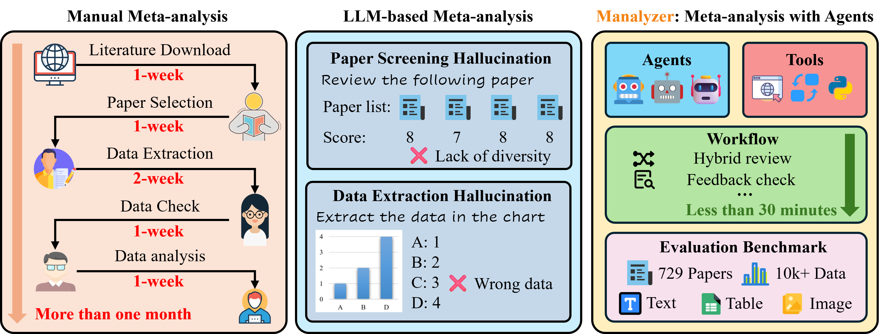
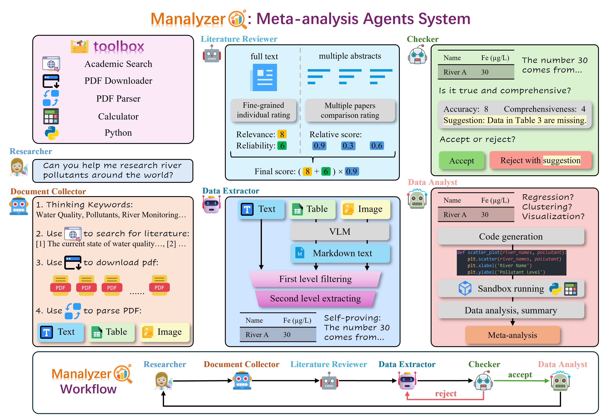

# Manalyzer: End-to-end Automated Meta-analysis with Multi-agent System

[\[📖 Project Page\]](https://black-yt.github.io/meta-analysis-page/) 
[\[🤗 HuggingFace\]](https://huggingface.co/datasets/CoCoOne/Manalyzer) 

---

## **Abstract**

Meta-analysis is a systematic research methodology that synthesizes data from multiple existing studies to derive comprehensive conclusions. This approach not only mitigates limitations inherent in individual studies but also facilitates novel discoveries through integrated data analysis. Traditional meta-analysis involves a complex multi-stage pipeline including literature retrieval, paper screening, and data extraction, which demands substantial human effort and time. However, while LLM-based methods can accelerate certain stages, they still face significant challenges, such as hallucinations in paper screening and data extraction. In this paper, we propose a multi-agent system, Manalyzer, which achieves end-to-end automated meta-analysis through tool calls. The hybrid review, hierarchical extraction, self-proving, and feedback checking strategies implemented in Manalyzer significantly alleviate these two hallucinations. To comprehensively evaluate the performance of meta-analysis, we construct a new benchmark comprising 729 papers across 3 domains, encompassing text, image, and table modalities, with over 10,000 data points. Extensive experiments demonstrate that Manalyzer achieves significant performance improvements over the LLM baseline in multi meta-analysis tasks.

---

## **Method Overview**

Manalyzer is a multi-agent system incorporating tool calling and feedback mechanisms, enabling end-to-end automated meta-analysis in real scientific research scenarios. We divide the meta-analysis process into three stages. The first stage involves receiving user input, searching for and downloading papers, followed by filtering out relevant and valuable ones. The second stage focuses on extracting data from these selected papers and integrating it into tables. The third stage is to analyze the integrated data and output the final meta-analysis report.

<!-- ## Updates/News 🆕

🚩 **Updates** (2025-05-xx) Initial upload to arXiv [[PDF]](https://arxiv.org/pdf/xxx). The code will be released soon. -->